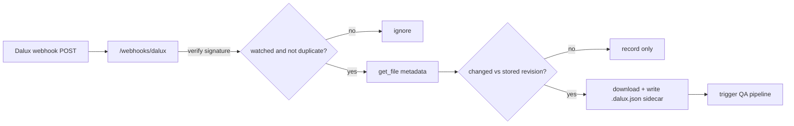

# Dalux Build Webhook Server

A small wrapper service around the Dalux Build API that downloads a watched set
of files **only when they actually change**, attaches the Dalux provenance to
each download, and triggers a downstream QA pipeline.

It is built on the [`dalux-build`](../python) Python client and exposes a
webhook receiver plus a conditional download endpoint.

## How it works



The webhook is treated as a wake-up signal only. Because the Dalux Build
OpenAPI document (`docs/official-api-docs/Dalux Build API.yaml`) does not define
webhooks, payloads are parsed defensively and every event is **re-confirmed**
against the API with `get_file` before anything is downloaded. Change detection
uses the `File` schema fields, preferring `contentHash`, then `fileRevisionId`,
then `(lastModified, fileSize)`.

## Requirements

- Python 3.9+
- The `dalux-build` client (installed from PyPI via `requirements.txt`, or use
  the in-repo source at [`../python`](../python) during development).

## Installation

```bash
cd webhook-server
python -m venv .venv
# Windows PowerShell: .venv\Scripts\Activate.ps1
source .venv/bin/activate
pip install -r requirements.txt
```

## Configuration

All configuration is via environment variables. Copy the example and edit it:

```bash
cp .env.example .env
```

| Variable | Required | Description |
|---|---|---|
| `DALUX_BASE_URL` | yes | Dalux API base URL (from Dalux support). |
| `DALUX_API_KEY` | yes | Server-side `X-API-KEY`. Never exposed to webhook callers. |
| `DALUX_WEBHOOK_SECRET` | recommended | Shared secret for HMAC-SHA256 signature verification. Empty disables verification (local only). |
| `DALUX_WEBHOOK_SIGNATURE_HEADER` | no | Header carrying the signature (default `X-Dalux-Signature`). |
| `WATCHLIST_PATH` | no | Path to the watch list JSON (default `./watchlist.json`). |
| `STATE_DB_PATH` | no | SQLite file for last-seen revisions and event idempotency. |
| `DOWNLOAD_DIR` | no | Where changed files and their `.dalux.json` sidecars are written. |
| `QA_WEBHOOK_URL` | no | If set, POST the change event JSON here. |
| `QA_WEBHOOK_TOKEN` | no | Optional bearer token for the QA webhook. |
| `QA_COMMAND` | no | If set (and no webhook URL), run this command with the event JSON on stdin. |
| `HOST` / `PORT` | no | Bind address (default `0.0.0.0:8000`). |

The environment is not auto-loaded from `.env`; export the variables yourself
(for example with `set -a; . ./.env; set +a`, `direnv`, or your process
manager / container runtime).

### Watch list

The watch list defines exactly which files the service reacts to. Copy
[`watchlist.example.json`](watchlist.example.json) to the path in
`WATCHLIST_PATH`:

```json
{
  "watch": [
    { "project_id": "p1", "file_area_id": "fa1", "file_id": "file-id-1" },
    { "project_id": "p1", "file_area_id": "fa1", "file_id": "file-id-2" }
  ]
}
```

Events for files that are not on the list are ignored.

## Running the server

```bash
python -m dalux_webhook
# or, with autoreload during development:
uvicorn "dalux_webhook.app:get_app" --factory --host 0.0.0.0 --port 8000
```

Endpoints:

| Method | Path | Purpose |
|---|---|---|
| `GET` | `/healthz` | Liveness probe; reports how many files are watched. |
| `POST` | `/webhooks/dalux` | Webhook receiver (verify -> confirm -> download -> QA). |
| `GET` | `/files/{file_id}` | Conditional download for pull-based clients. |

### Production notes

- Terminate TLS in front of the service (reverse proxy such as nginx/Caddy, or
  a cloud load balancer). Dalux must reach the receiver over HTTPS.
- Register the public `https://<host>/webhooks/dalux` URL with Dalux. Webhook
  setup, the signing scheme, and the exact payload shape are **not** in the
  public OpenAPI spec, so confirm them with Dalux product docs or support, then
  adjust `DALUX_WEBHOOK_SIGNATURE_HEADER` and, if needed,
  `dalux_webhook/webhook.py::extract_file_refs` to match a real payload.
- Webhook retries are deduplicated by event id (`STATE_DB_PATH`). The default
  SQLite store assumes a single instance; use an external store for multiple
  replicas.

## Using the conditional download endpoint

For clients that prefer to poll the wrapper instead of receiving webhooks:

```bash
# First request returns the file and an ETag (the Dalux contentHash/revision).
curl -i "http://localhost:8000/files/file-id-1"

# Subsequent request with the ETag returns 304 when nothing changed.
curl -i -H 'If-None-Match: "<etag-from-previous-response>"' \
  "http://localhost:8000/files/file-id-1"
```

If a file is not on the watch list, pass `project_id` and `file_area_id` as
query parameters.

## Testing the webhook locally

With `DALUX_WEBHOOK_SECRET=s3cret`, sign the body and POST it:

```bash
BODY='{"eventId":"e1","fileId":"file-id-1","projectId":"p1","fileAreaId":"fa1"}'
SIG=$(printf '%s' "$BODY" | openssl dgst -sha256 -hmac "s3cret" | awk '{print $2}')
curl -i -X POST http://localhost:8000/webhooks/dalux \
  -H "Content-Type: application/json" \
  -H "X-Dalux-Signature: $SIG" \
  -d "$BODY"
```

The response lists which watched files were processed and whether each changed.

## QA pipeline integration

When a watched file is confirmed changed, the service sends an event like:

```json
{
  "type": "dalux.file.changed",
  "projectId": "p1",
  "fileAreaId": "fa1",
  "fileId": "file-id-1",
  "fileRevisionId": "...",
  "contentHash": "...",
  "fileName": "Model.ifc",
  "downloadedPath": "downloads/Model.ifc",
  "sidecarPath": "downloads/Model.ifc.dalux.json"
}
```

Route it either by HTTP (`QA_WEBHOOK_URL`, e.g. a CI webhook, a queue ingest, or
a GitHub `repository_dispatch` proxy) or by running a local command
(`QA_COMMAND`) that receives the event JSON on stdin.

## File provenance and `.ifc` comparison

Each download is paired with a sidecar `<name>.dalux.json` written next to the
file, containing `fileId`, `fileRevisionId`, `contentHash`, `fileSize`,
`lastModified`, `version`, and a `downloadedAt` timestamp. QA jobs can read the
sidecar to decide whether a model needs re-processing without re-downloading.
The IFC bytes are never modified, so viewers and STEP parsers are unaffected. If
you later need the metadata embedded inside the IFC model graph, add an
IfcOpenShell-based `IfcPropertySet` writer in `dalux_webhook/ifc_metadata.py`;
the comparison helpers stay the same.

## Polling fallback

If webhooks are unavailable, or to heal missed deliveries, run the poller:

```bash
# Check each watched file once (parallel-safe, per-file metadata):
python -m dalux_webhook.poller

# Repeat every 5 minutes:
python -m dalux_webhook.poller --interval 300

# Shrink candidates first via list_files(updatedAfter) then intersect ids:
python -m dalux_webhook.poller --mode list --updated-after 2024-01-01
```

The files endpoint has no OData `$filter`, so the `list` mode intersects the
listing with the watch list client-side.

### Scheduling

There are two ways to schedule the poller, both of which avoid adding the poll's
run time to the gap between checks:

1. **OS cron / systemd timer / Task Scheduler (recommended).** Run the poller in
   run-once mode (`--interval 0`, the default) and let the scheduler fire it on a
   fixed wall-clock cadence. Each tick is an independent process, so there is no
   drift and a slow run never delays the next tick's start.

   Linux crontab (every 5 minutes):

   ```cron
   */5 * * * * cd /opt/dalux-webhook && /opt/dalux-webhook/.venv/bin/python -m dalux_webhook.poller >> /var/log/dalux-poller.log 2>&1
   ```

   systemd timer (`dalux-poller.timer` + `dalux-poller.service` with `OnUnitActiveSec=5min`), or Windows Task Scheduler running the same `python -m dalux_webhook.poller` command, work the same way. In Kubernetes use a `CronJob`.

2. **Long-lived `--interval` process.** `python -m dalux_webhook.poller --interval 300`
   keeps running and wakes every 300 s on a **fixed-rate monotonic schedule** —
   the next wake-up is anchored to the cycle start, not the cycle end, so a poll
   that takes 20 s still wakes at the 300 s mark. If a cycle overruns the
   interval, missed ticks are skipped (logged as a warning) to avoid a burst.

Make sure the cron/timer environment exports the same variables as `.env`
(cron runs with a minimal environment); load them in the command or a wrapper
script.

## Running the tests

```bash
cd webhook-server
pip install -r requirements.txt
pip install pytest
pytest -q
```

The suite covers signature verification, payload parsing, change detection, the
sidecar logic, the state store, and the webhook receiver flow.

## Project layout

```
webhook-server/
  README.md
  requirements.txt
  pyproject.toml
  .env.example
  watchlist.example.json
  dalux_webhook/
    app.py            # FastAPI app: webhook receiver + conditional download
    config.py         # env-driven settings
    dalux.py          # dalux-build wrapper: metadata-first, then bytes
    ifc_metadata.py   # JSON sidecar provenance for downloaded files
    metadata.py       # change detection from the Dalux File schema
    poller.py         # polling fallback
    qa.py             # outbound QA trigger (HTTP or command)
    store.py          # SQLite state: last-seen revision + idempotency
    watchlist.py      # watched files index
  tests/
```
